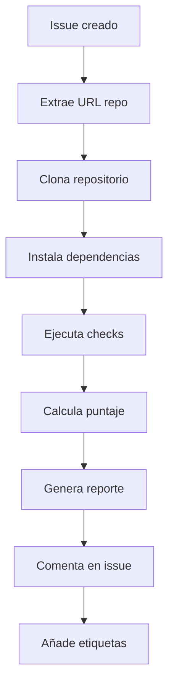

<div align="center">

<svg width="600" height="200" xmlns="http://www.w3.org/2000/svg">
  <!-- Background gradient -->
  <defs>
    <linearGradient id="bgGradient" x1="0%" y1="0%" x2="100%" y2="100%">
      <stop offset="0%" style="stop-color:#667eea;stop-opacity:1" />
      <stop offset="100%" style="stop-color:#764ba2;stop-opacity:1" />
    </linearGradient>
    <linearGradient id="textGradient" x1="0%" y1="0%" x2="100%" y2="0%">
      <stop offset="0%" style="stop-color:#ffffff;stop-opacity:1" />
      <stop offset="100%" style="stop-color:#f0f4f8;stop-opacity:1" />
    </linearGradient>
    <filter id="glow" x="-20%" y="-20%" width="140%" height="140%">
      <feGaussianBlur stdDeviation="3" result="coloredBlur"/>
      <feMerge> 
        <feMergeNode in="coloredBlur"/>
        <feMergeNode in="SourceGraphic"/>
      </feMerge>
    </filter>
  </defs>
  
  <!-- Background -->
  <rect width="600" height="200" rx="15" fill="url(#bgGradient)" />
  
  <!-- Decorative elements -->
  <circle cx="50" cy="50" r="25" fill="#00d4aa" opacity="0.3"/>
  <circle cx="550" cy="150" r="30" fill="#ff6b6b" opacity="0.3"/>
  <polygon points="520,40 540,20 560,40 540,60" fill="#ffd93d" opacity="0.4"/>
  
  <!-- Rocket icon -->
  <g transform="translate(30, 80)">
    <path d="M20 40 L25 20 L30 40 L25 35 Z" fill="#00d4aa" filter="url(#glow)"/>
    <circle cx="25" cy="30" r="3" fill="#ffffff"/>
    <path d="M15 35 L20 40 L30 40 L35 35" stroke="#00d4aa" stroke-width="2" fill="none"/>
  </g>
  
  <!-- Main title -->
  <text x="300" y="80" font-family="Arial, sans-serif" font-size="32" font-weight="bold" text-anchor="middle" fill="url(#textGradient)">
    EVALUADOR AUTOMÁTICO
  </text>
  
  <!-- Subtitle -->
  <text x="300" y="110" font-family="Arial, sans-serif" font-size="20" text-anchor="middle" fill="#ffffff" opacity="0.9">
    FastAPI Semana 1
  </text>
  
  <!-- Features -->
  <g transform="translate(120, 140)">
    <text font-family="Arial, sans-serif" font-size="14" fill="#ffffff">
      <tspan x="0" dy="0">⚡ Feedback Instantáneo</tspan>
      <tspan x="140" dy="0">🎯 Criterios Transparentes</tspan>
      <tspan x="300" dy="0">🔄 Mejora Continua</tspan>
    </text>
  </g>
  
  <!-- Progress indicator -->
  <g transform="translate(200, 165)">
    <rect x="0" y="0" width="200" height="4" rx="2" fill="#ffffff" opacity="0.3"/>
    <rect x="0" y="0" width="160" height="4" rx="2" fill="#00d4aa"/>
    <text x="210" y="6" font-family="Arial, sans-serif" font-size="10" fill="#ffffff" opacity="0.8">80% Automatización</text>
  </g>
</svg>

[](https://fastapi.tiangolo.com/)
[](https://python.org)
[](https://github.com/features/actions)
[](https://github.com)

</div>

---

## 📋 ¿Qué es esto?

Este es un sistema de **evaluación automática** diseñado para validar tus proyectos de la **Semana 1 de FastAPI**. Es como tener un instructor virtual que revisa tu código las 24 horas del día y te da feedback inmediato.

## 🎯 ¿Por qué existe este evaluador?

### Para ti como aprendiz:

- **⚡ Feedback instantáneo**: No esperas días para saber si tu proyecto está bien
- **🎯 Criterios claros**: Sabes exactamente qué se evalúa y cómo
- **🔄 Iteración rápida**: Puedes mejorar tu código y re-evaluarlo inmediatamente
- **📈 Autoaprendizaje**: Aprendes de tus errores de manera autónoma

### Para los instructores:

- **⏰ Ahorro de tiempo**: Evaluación objetiva y consistente
- **📊 Métricas claras**: Seguimiento del progreso de todos los estudiantes
- **🎯 Enfoque en mentoría**: Más tiempo para ayudar con conceptos complejos

## 🎯 ¿Para qué sirve?

Este evaluador verifica que hayas completado correctamente los **fundamentos de FastAPI**:

### 🏗️ **Setup del Proyecto (25 puntos)**

- ✅ Archivo `requirements.txt` con las dependencias correctas
- ✅ Archivo `main.py` como punto de entrada
- ✅ Documentación básica en `README.md`
- ✅ Instalación correcta de FastAPI y Uvicorn

### 🌍 **Hello World API (25 puntos)**

- ✅ Aplicación FastAPI funcional (`app = FastAPI()`)
- ✅ Endpoint básico `GET /` que responde con JSON
- ✅ Endpoint con parámetros (ej: `/hello/{nombre}`)

### 🧪 **Testing & Docs (25 puntos)**

- ✅ Documentación automática accesible en `/docs`
- ✅ Respuestas en formato JSON válido
- ✅ Manejo básico de errores

### 📦 **Entregables (15 puntos)**

- ✅ Estructura de proyecto organizada
- ✅ Archivos principales presentes
- ✅ Configuración adecuada

### 🧠 **Comprensión (10 puntos)**

- ✅ README con comandos de instalación y ejecución
- ✅ Screenshot de `/docs` funcionando
- ✅ Reflexión sobre FastAPI y APIs REST

## 🚀 ¿Cómo funciona?

### 1. **Creas tu proyecto** 📝

```
mi-proyecto-fastapi/
├── main.py
├── requirements.txt
└── README.md
```

### 2. **Subes a GitHub** 🌐

Tu repositorio debe ser **público** para que el evaluador pueda acceder.

### 3. **Envías para evaluación** 📤

Usas el template de issue en este repositorio con la URL de tu proyecto.

### 4. **Evaluación automática** 🤖

El sistema:

- 🔍 Clona tu repositorio
- 📦 Instala las dependencias
- 🧪 Ejecuta todas las pruebas
- 📊 Genera un reporte detallado

### 5. **Recibes feedback** 📋

En pocos minutos obtienes:

- **Puntaje total** (de 0 a 100)
- **Desglose por criterios**
- **Feedback específico** para mejorar
- **Estado**: ✅ Aprobado (≥70) o 🕐 Pendiente (<70)

## 📊 Ejemplo de Evaluación

```markdown
✅ **APROBADO** — Puntaje: **85/100**

### Desglose por criterio

| Criterio        | Puntaje |
| --------------- | ------: |
| Setup           |      25 |
| Hello World API |      20 |
| Testing & Docs  |      25 |
| Entregables     |      15 |
| Comprensión     |       0 |

### Feedback accionable

• Agrega una reflexión corta (2–3 oraciones) sobre FastAPI y API REST.
• Agrega un screenshot de `/docs` funcionando al README.
```

## 🎯 Criterios de Aprobación

- **🎯 Puntaje mínimo**: 70/100
- **📋 Elementos obligatorios**:
  - `main.py` con aplicación FastAPI funcional
  - `requirements.txt` con fastapi y uvicorn
  - `README.md` con instrucciones básicas
  - Endpoint `GET /` que responde JSON
  - `/docs` accesible

## 🛠️ ¿Cómo usar este evaluador?

### Como estudiante:

1. **Desarrolla tu proyecto** siguiendo las especificaciones de la Semana 1
2. **Sube tu código** a un repositorio público en GitHub
3. **Crea un issue** usando el template "Entrega Semana 1 - FastAPI"
4. **Espera el feedback** (usualmente en 2-3 minutos)
5. **Mejora tu código** basándote en las recomendaciones
6. **Re-evalúa** editando el mismo issue

### Como instructor:

1. Los estudiantes envían sus entregas vía issues
2. El sistema evalúa automáticamente
3. Revisas solo los casos que requieren atención manual
4. Tienes métricas centralizadas de progreso

## 🔧 Arquitectura Técnica

### Componentes principales:

- **`checks_structure.py`**: Verifica archivos requeridos
- **`checks_requirements.py`**: Valida dependencias
- **`checks_app_import.py`**: Prueba importación de la app
- **`checks_endpoints.py`**: Testa endpoints con TestClient
- **`checks_readme.py`**: Analiza documentación
- **`scoring.py`**: Calcula puntajes por criterio
- **`report_md.py`**: Genera feedback en Markdown

### Flujo de evaluación:



## 🚨 Troubleshooting Común

### ❌ "main.py no encontrado"

- **Causa**: El archivo no está en la raíz del repositorio
- **Solución**: Asegúrate de que `main.py` esté en la raíz, no en una subcarpeta

### ❌ "No se pudo importar app"

- **Causa**: Error de sintaxis o `app = FastAPI()` faltante
- **Solución**: Verifica que tu código compile y tenga `app = FastAPI()`

### ❌ "GET / no responde 200"

- **Causa**: Falta el endpoint raíz
- **Solución**: Agrega `@app.get("/")` con una función que retorne JSON

### ❌ "/docs no es accesible"

- **Causa**: La aplicación no se inicia correctamente
- **Solución**: Verifica que no haya middlewares bloqueando o errores en la app

## 🏆 Tips para el Éxito

### ✅ **Estructura recomendada**:

```
mi-proyecto/
├── main.py                 # Tu aplicación FastAPI
├── requirements.txt        # fastapi, uvicorn
├── README.md              # Instrucciones + reflexión
└── screenshots/           # Imágenes para README
    └── docs-screenshot.png
```

### ✅ **main.py mínimo**:

```python
from fastapi import FastAPI

app = FastAPI()

@app.get("/")
def read_root():
    return {"message": "Hello World"}

@app.get("/hello/{name}")
def say_hello(name: str):
    return {"message": f"Hello {name}"}
```

### ✅ **requirements.txt**:

```
fastapi>=0.68.0
uvicorn[standard]>=0.15.0
```

### ✅ **README.md completo**:

- Comandos de instalación: `pip install -r requirements.txt`
- Comando para ejecutar: `uvicorn main:app --reload`
- Screenshot de `/docs`
- Reflexión sobre FastAPI (2-3 oraciones)

## 📞 Soporte

Si tienes problemas con el evaluador:

1. **Revisa este README** completo
2. **Verifica que tu repo sea público**
3. **Asegúrate de seguir la estructura exacta**
4. **Contacta a tu instructor** si persisten problemas técnicos

---

> 💡 **Recuerda**: Este evaluador es una herramienta de aprendizaje. Su objetivo es ayudarte a interiorizar los conceptos fundamentales de FastAPI mediante feedback inmediato y criterios claros.

¡Buena suerte con tu proyecto! 🚀
